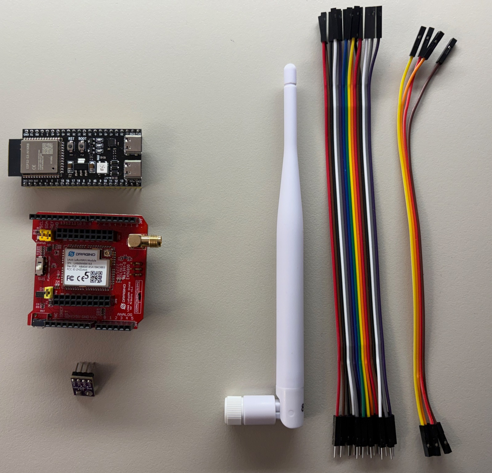
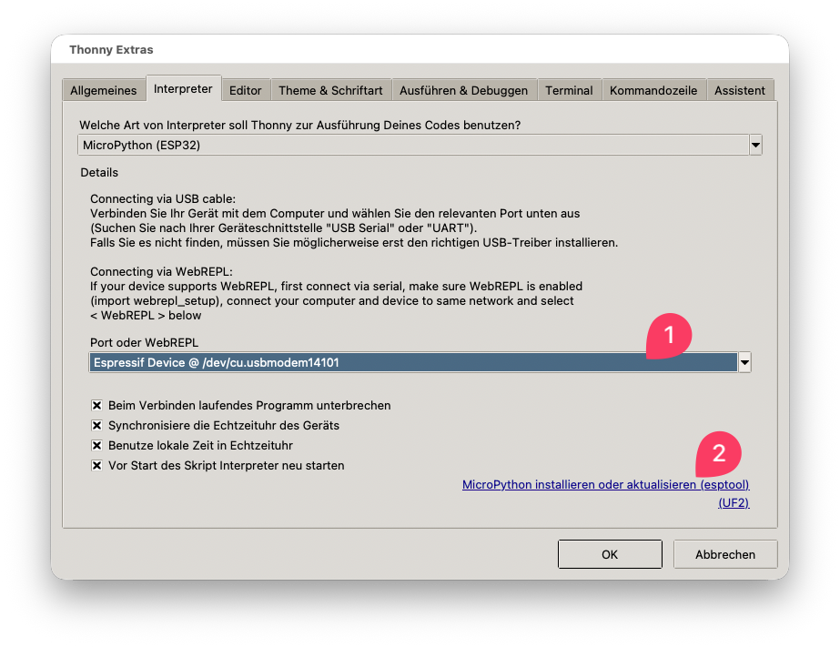
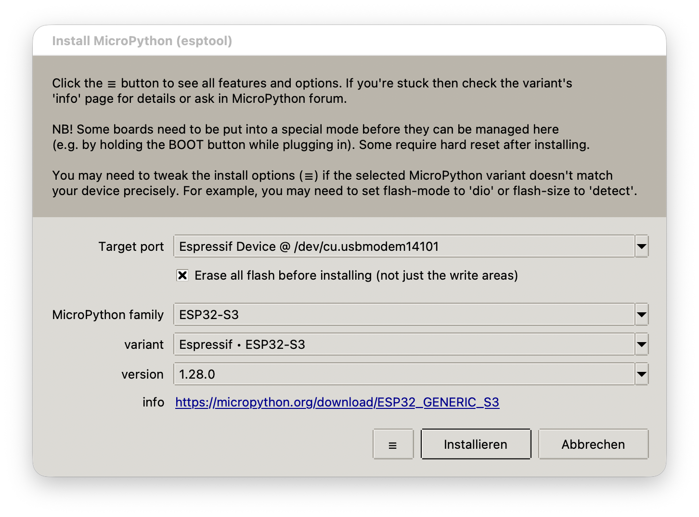
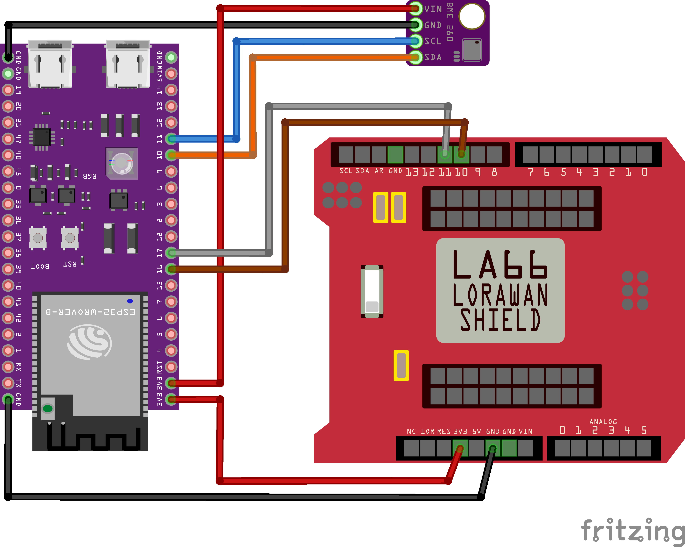
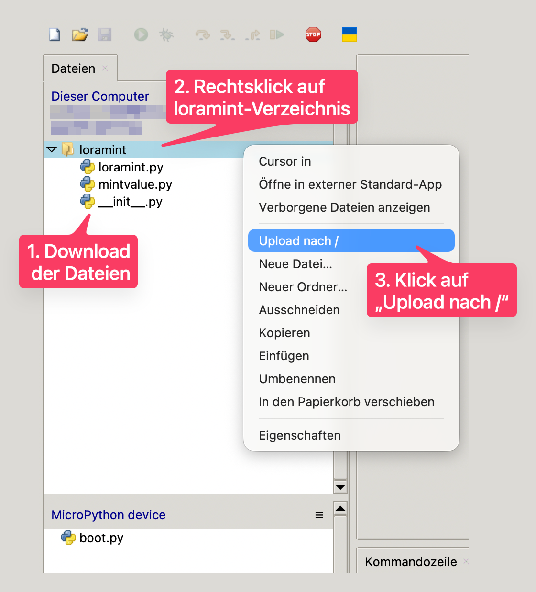

# LoRaMINT mit Thonny verwenden – Schritt für Schritt

Mit dieser Anleitung bringst du einen **ESP32** dazu, mit dem Funkmodul
**Dragino LA66** Messwerte an das Netzwerk **TTN** und weiter ans
**LoRaMINT‑Backend** zu funken. Programmiert wird in der einsteigerfreundlichen
App **[Thonny](https://thonny.org/)** – ganz ohne Vorkenntnisse.

> **Hinweis für die Web‑Umsetzung:** Blöcke mit ⬇️ (*Download*) oder
> 🧩 (*Web‑Feature*) sind Anmerkungen für die spätere Webseite und gehören nicht
> zum eigentlichen Anleitungstext.

---

## 0. Was du brauchst

**Hardware**
- ESP32‑Board (z. B. ESP32 oder ESP32‑S3) mit USB‑Kabel
- Dragino LA66 Funkmodul mit **Antenne** (Antenne aufschrauben!)
- ein paar Steckkabel (Jumperkabel)
- BME280‑Sensor (misst Temperatur, Luftfeuchte und Luftdruck)



**Das erledigt vorab eure Lehrkraft / der Administrator** – darum musst du dich
nicht kümmern:
- Das Funkmodul (LA66) muss in der **TTN‑Konsole** angemeldet sein
  (die Schlüssel DevEUI/AppEUI/AppKey).

---

## 1. Thonny und MicroPython einrichten

### Thonny installieren

Thonny ist das Programm, mit dem du auf deinem Computer Code schreibst und ihn
auf das ESP32‑Board überträgst.

1. Lade Thonny von **<https://thonny.org/>** herunter und installiere es
   (Windows/macOS/Linux).
2. Starte Thonny. Ist die Oberfläche auf Englisch, kannst du unter
   **Tools → Options → General → Language** auf Deutsch umstellen.

### MicroPython auf den ESP32 flashen

Damit das Board Python „versteht", spielst du ihm einmalig **MicroPython** auf –
das ist eine abgespeckte Python‑Version für kleine Mikrocontroller.

1. Verbinde das ESP32‑Board per USB mit dem Computer.
   > **Board wird nicht gefunden?** Dann fehlt der **USB‑Treiber** (CP210x oder
   > CH340). Installiere ihn und probiere ein anderes USB‑Kabel (manche Kabel
   > können nur laden, nicht Daten übertragen).
2. Öffne **Extras → Optionen → Interpreter**.
3. Wähle oben **„MicroPython (ESP32)"**.
4. Wähle darunter den **Port** deines Boards – das ist der Anschluss, über den
   dein Computer mit dem Board spricht (①).

   

5. Klicke unten auf **„MicroPython installieren oder aktualisieren"** (②).
6. Im Dialog **Family** und **Variant** passend zum Board wählen und auf
   **Installieren** klicken. Kommt ein Verbindungsfehler, halte die
   **BOOT‑Taste** am Board gedrückt, während die Installation startet.

   

7. Danach den Dialog schließen und mit **OK** bestätigen.

### Board mit Thonny verbinden

1. Unten in Thonny erscheint die **Shell** – ein Eingabefeld mit dem Zeichen
   `>>>`, in das du direkt Befehle tippen kannst. Fehlt sie, öffne noch einmal
   **Extras → Optionen → Interpreter**, prüfe den Port und drücke den roten
   **Stopp‑Knopf**.
2. Tippe zum Testen in die Shell:
   ```python
   print("Hallo ESP32")
   ```
   Erscheint `Hallo ESP32`, klappt die Verbindung. 🎉

> **Wichtig – immer nur ein Programm am Port:** Solange Thonny mit dem Board
> verbunden ist, darf kein anderes Programm den Port benutzen, sonst gibt es
> einen Fehler.

---

## 2. Alles verkabeln

Damit ESP32 und Funkmodul miteinander reden können, verbindest du sie mit vier
Kabeln (das nennt man **UART** – eine einfache serielle Verbindung). Wichtig:
**TX geht immer auf RX** und umgekehrt (Senden ↔ Empfangen), sonst hören beide
nicht zu. Die folgende Skizze zeigt die **komplette Verkabelung inklusive
BME280‑Sensor**.



**ESP32 ↔ LA66 (Funkmodul)**

| ESP32 | LA66 |
|-------|------|
| `GPIO17` (TX = Senden) | RX (`PIN 11`) |
| `GPIO16` (RX = Empfangen) | TX (`PIN 10`) |
| `GND` (Minus) | `GND` |
| `3V3` (Strom) | `3V3` |

> 🧩 **Web‑Feature:** Bild anklickbar/zoombar (Lightbox), damit man die
> Kabelverbindungen genau erkennt.

---

## 3. Die `loramint`‑Bibliothek auf das Board laden

`loramint` ist unsere fertige Programm‑Bibliothek. Sie übernimmt das komplizierte
Funken, damit dein Code kurz bleibt. Du kopierst den Ordner `loramint/` auf das
Board:

1. Lade die Bibliothek herunter (siehe ⬇️ unten) und aktiviere in Thonny
   **Ansicht → Dateien**. Es erscheinen zwei Bereiche: oben **dein Computer**,
   unten das **„MicroPython device"** (das Board).
2. Gehe im oberen Bereich in den Ordner mit den heruntergeladenen Dateien.
3. **Rechtsklick** auf den Ordner **`loramint`** → **„Upload nach /"**.
4. Unten (auf dem Gerät) muss danach der Ordner **`loramint`** auftauchen.



> ⬇️ **Download (eigener Code):** die Bibliothek
> [`loramint/`](../loramint) – das sind die Dateien `__init__.py`, `loramint.py`
> und `mintvalue.py`.
> 🧩 **Web‑Feature:** „Bibliothek als ZIP herunterladen"‑Button, weil man einen
> ganzen Ordner nicht mit einem einzelnen Klick laden kann.

---

## 4. Verbindung zum LA66 testen

Bevor du funkst, prüfst du kurz, ob ESP32 und LA66 sich „hören". Lege in Thonny
ein neues Skript an (**Datei → Neu**) und schreibe:

```python
from loramint import LoRaMINT

lora = LoRaMINT()          # Standard: TX=GPIO17, RX=GPIO16
lora.check_connection()    # gibt eine Statusmeldung aus
```

Führe das Programm aus (grüner Play‑Knopf oder Taste **F5**). In der Shell sollte
eine Erfolgsmeldung mit der Firmware‑Version des LA66 erscheinen. Kommt keine
Antwort:
- Verkabelung prüfen (TX↔RX gekreuzt? GND verbunden?),
- oder andere Pins angeben: `LoRaMINT(uart_id=1, tx=4, rx=5)`.

> 🧩 **Web‑Feature:** „Code kopieren"‑Button an jedem Code‑Block.

---

## 5. Temperatur mit dem BME280 senden

Jetzt sendest du echte Messwerte. Das fertige Programm `send_temperature.py`
liest den BME280‑Sensor aus und funkt die Temperatur einmal pro Minute.

1. **BME280 anschließen.** Der Sensor ist in der Verkabelungs‑Skizze
   (Abschnitt 2) bereits enthalten – schließe ihn wie dort gezeigt über **I2C**
   an: **SDA an GPIO10**, **SCL an GPIO11** sowie **GND** und **3V3**
   (Sensor‑Adresse `0x76`).

2. **Sensor‑Treiber laden.** Der BME280‑Treiber gehört nicht zu uns, sondern ist
   fertiger Fremdcode. Lade eine Treiberdatei herunter und lege sie – genau wie
   in Schritt 3 über **Ansicht → Dateien** – als **`bme280.py`** auf das Board.

   > 🔗 **Fremdcode (extern verlinkt):**
   > [robert‑hh/BME280 auf GitHub](https://github.com/robert-hh/BME280) – lade
   > dort die passende Treiberdatei (z. B. `bme280_float.py`) herunter und
   > **speichere sie auf dem Board als `bme280.py`** (so heißt sie im Beispiel).

3. **Programm öffnen und starten:** `send_temperature.py` in Thonny öffnen, die
   Pins ggf. anpassen und starten (grüner Play‑Knopf oder **F5**). In der Shell
   siehst du:
   - `Joining LoRaWAN network...` – das Board meldet sich im Funknetz an
   - `Joined.` (kann bis zu einer Minute dauern)
   - danach im Minutentakt `Measurement sent: 21.5`

   > ⬇️ **Download (eigener Code):**
   > [`send_temperature.py`](../examples/send_temperature.py) · weitere Beispiele:
   > [`send_humidity.py`](../examples/send_humidity.py) (Feuchte),
   > [`send_pressure.py`](../examples/send_pressure.py) (Luftdruck),
   > [`main.py`](../examples/main.py) (sendet feste Testwerte, ganz **ohne** Sensor).

Klappt die Anmeldung nicht (`txTimeout`), wurde zwar gefunkt, aber kein Gateway
hat geantwortet – Schlüssel in TTN und die Antenne prüfen.

### Damit das Programm nach dem Einschalten von allein läuft

Ein Programm mit dem Namen **`main.py`** startet der ESP32 automatisch, sobald er
Strom bekommt. So speicherst du dein Beispiel als `main.py` auf das Board:

1. Das geöffnete Beispiel über **Datei → Speichern unter** sichern.
2. Als Ort **„MicroPython‑Gerät"** wählen.
3. Als Dateiname **`main.py`** eingeben.
4. Board neu starten (Reset‑Taste) → das Programm läuft von allein.

> Zum **Stoppen** eines automatisch laufenden Programms den Stopp‑Knopf drücken
> oder in der Shell **Strg + C**.

---

## 6. Wenn etwas nicht klappt

> 🧩 **Web‑Feature:** Diese Liste als aufklappbaren Bereich (Accordion)
> darstellen, damit die Anleitung kurz bleibt.

| Problem | Lösung |
|---------|--------|
| Board erscheint unter keinem Port | USB‑Treiber (CP210x/CH340) installieren, anderes USB‑Kabel testen |
| „Could not connect" beim Flashen | **BOOT‑Taste** gedrückt halten, während die Installation startet |
| Verbindung / Port belegt | anderes Programm am Port schließen – nur Thonny darf ihn nutzen |
| `check_connection` meldet nichts | Verkabelung prüfen: TX↔RX gekreuzt, GND verbunden, richtige Pins |
| Anmeldung `txTimeout` | Schlüssel in TTN prüfen, Antenne anschließen, in Gateway‑Reichweite gehen |
| Zweite Nachricht schlägt fehl | zu schnell hintereinander gefunkt – mindestens ~10 Sekunden warten |
| Umlaute kommen falsch an | nur einfache Zeichen senden (`"*C"` statt `"°C"`) |

---

Geschafft! 🎉 Dein ESP32 funkt jetzt Messwerte über den LA66 an TTN, und das
LoRaMINT‑Backend speichert sie. Deine Daten kannst du dir live als Diagramm
ansehen: **[www.loramint.de/plots](https://www.loramint.de/plots)** (sowie unter
**Export** und **Status**).
